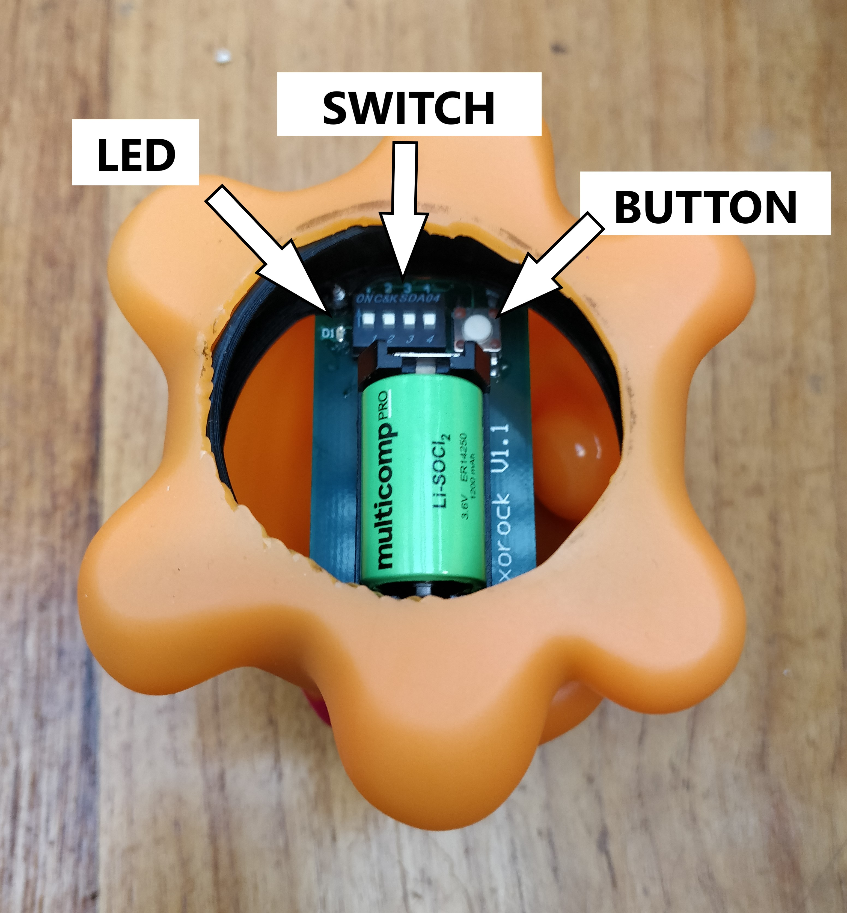
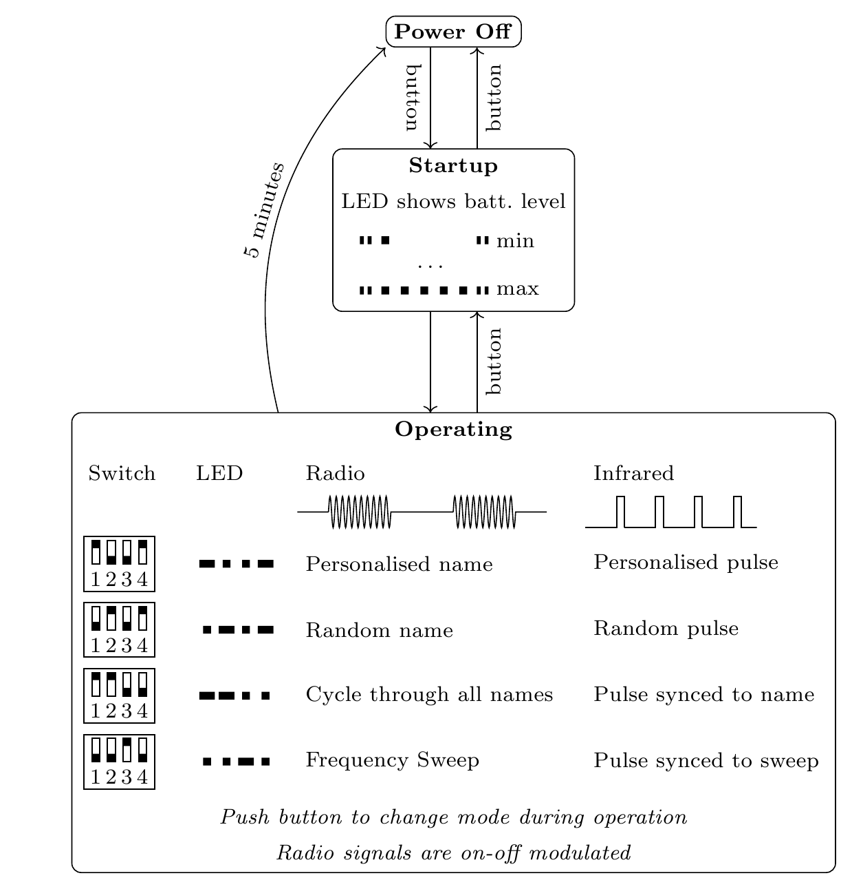

# EEERover Technical Guide

This guide has three main aims:
 - Document the additional hardware that you are provided with to get started
 - Specify the processes you will need to develop your design (e.g.~ordering components)
 - Provide some implementation ideas that you may find useful
	
 Most of the contents of this guide is advisory. You do not have to use your EEEBug or the items in the starter kit if you wish to pursue different ideas.
	
 ## Expansion Kit
 You are provided with some parts to use with your Lab-in-a-Box kit to get started:
 
| Qty         | Description |
| ----------- | ----------- |
| 1           | Alien simulator  |
| 2           | H-Bridge Motor Driver Module |	
| 2           | Adafruit Metro M0 Microcontroller Module |
| 2           | Adafruit WINC1500 WiFi Shield |
| 2†          | Magnet |
			
You are given one expansion kit per group in your allocated shelf.
It is designed for use with your existing EEEBug chassis.
At the rear of the chassis is a mounting point for the Metro board and the central PCB has mounting points for the motor driver module.
The breadboard, as you have already seen, is ideal for prototyping circuits.
Finally, the design of the chassis is available to download that you can produce your own version.
    
### Motor Driver

The project kit contains a motor driver module to make it easy to control power to the motors.
The motor driver is an integrated *H Bridge* with decode logic, illustrated below.
The H-bridge allows current to be driven in either direction through the central load by connecting one terminal to the positive supply and the other to ground.

The module contains two H-bridges, one for each motor.
Each channel has two digital inputs, DIR and PWM, which are decoded and used to control four MOSFETs.
The MOSFETs are driven with binary inputs so that they act as switches and the impedance is either very low or very high.
The motor driver module plugs into the motor power connectors on the EEEBug PCB.

The module inputs can be connected directly to digital outputs on the Metro board.
DIR controls the motor direction and the motor speed can be controlled by applying a rectangular waveform to the PWM input and varying the duty cycle — use `analogWrite()` in the Arduino API to generate a PWM signal.
			
### Metro M0 board

The Adafruit Metro M0 Express board is a embedded computing platform based on an ARM M0 microcontroller and compatible with the Arduino form factor, libraries and development tools.
It is programmed in C++ and features digital inputs and outputs, inputs with digital-to-analogue conversion and PWM outputs. Internet connectivity is provided by a Adafruit WINC1500 WiFi Shield, which plugs into the Metro board.

You are provided with demonstration code that shows the use of basic functions of the Metro board.
The WiFi interface is used to host a basic webpage, which you will see hard-coded into the demonstration code.
The webpage provides two links which, when pressed, turn on and off the onboard LED.
Use the Arduino Serial Monitor to connect to the board via USB and you will see some debug messages reporting on the connection status.
Whenever the webpage is retrieved you will see the HTML request made by the web browser.
			
Arduino is a popular platform for prototyping and you will find a lot of information and many code examples on the internet.
Use these resources but beware that many are provided by third parties and may not be well-written or even correct!
			
### Starter code

This repository contains [microcontroller code](../metro-starter-arduino/README.md) to get you started.
You can continue to use Arduino IDE as in the lab skills work, or you can develop with Visual Studio Code and Platformio.
			
 ### Connections and Power
 
> **Warning**
> 
> The logic level of the Metro board is 3.3V, which is supplied by an on-board voltage regulator.
> You will damage the board if you connect the input/output pins to a voltage greater than 3.3V.

Use potential dividers to reduce voltages greater than 3.3V and measure the output voltage of your circuits before connecting them to the inouts of the Metro board.
The safest option is to design add-on circuits with a 3.3V power supply.
Digital inputs should be 0V for logic low and 3.3V for logic high.
Analogue inputs should be in the range 0--3.3V.

*Pinout for the Metro M0 Express module from [Adafruit](https://learn.adafruit.com/adafruit-metro-m0-express/pinouts)*

The pin locations and functions are broadly compatible with the Arduino layout used on the Orangepip Kona328 board used in the Microcontroller lab experiment.
The I/O pins pass through the WiFi Shield when it is connected, but the pins labelled CS, IRQ and RST on the WiFi Shield (Arduino pins 5,7 and 10) are used by WiFi and can't be used for other purposes. 

The Metro board can be powered by USB, the power jack or the EEEBug batteries.
To connect to the EEEBug batteries you will need to make the following connections between the Metro board and the EEEBug PCB:

- 5V → 5V
- GND → GND

> **Warning**
> 
> Always check connections before switching on the power.
> You may damage the microcontroller if you make a mistake
			
You can use the 5V or 3.3V nodes to power your own circuit.
It is not recommended to use Vin or Vbatt, since the voltage of these will vary depending on the power source.
The motors will run slowly if the battery is not available.
			

*A simplified diagram showing the connection of the Metro M0 Express and EEERover PCB power supplies*
			
 ### Alien simulator
      
Your prototype will be developed and tested using alien simulators: electronic devices which can replicate the charcteristics of the real aliens.
An alien simulator is included in your kit to aid development.
 

					
The alien is configured by setting a group of DIP switches on its internal PCB.
A push button is used to turn it on and off, and an LED indicates when it is active.
A flow chart depicting the operation of the alien is shown below.
From standby (inactive) mode, press the button to turn on and observe the LED flashes to determine whether the battery has sufficient charge.
After the battery display sequence is complete the alien begins emitting signals according to the mode set up on the DIP switches.
The LED flashes a code at intervals to confirm the mode selection and indicate operation.

In normal operation, the alien transmits its personalised name and pulse continuously — this will be the mode used in the final demonstration.
Other modes are available to help testing:
- The alien can transmit a random name and pulse frequency, which will change each time it is restarted.
- The alien can continuously cycle through all the possible names. In this mode, the pulse is synchronised to the start of each radio transmission, which can be used as an oscilloscope trigger to facilitate testing.
- The alien can transmit a continuous radio frequency with a sweeping carrier frequency. This can be used to test the frequency response of the receiver circuit.

		
Pushing the button during operation will reset the alien — this is necessary to change the operation mode.
A second press soon afterwards will turn the device off.
If the alien is left operating for five minutes it will automatically power off to preserve the battery.
			
The alien cannot simulate the magnetic property in an readily-configurable manner so you are provided with a small magnet to test this functionality.
In the demo, magnets will be placed inside the alien approximately 10mm below the highest point on its top.
The polarity of the magent in your kit depends on the colour of the disc:

			
The radio signal is emmitted from a coil antenna in the plane of the PCB.	
			
 ## Components and Construction
 ### Ordering components

A tool for ordering components will be released later in the term. Each project group has a budget of £60 to cover all the additional components you'll need for designing and building your prototype.

 - [ ] Add ordering tool

You will receive an email when the parts are available for collection from Stores on level 1, near the lifts. Orders, assuming the items are in stock, will take up to a week to arrive. You can order some components directly from stores stock and these will usually be available for collection sooner.
			
Please be aware of the following rules and common pitfalls when ordering components:
 - You must only order items that you can use safely. If you have any doubts about this then talk to a member of staff before ordering. Do not order batteries, chemicals (including glue), tools or mains-powered equipment/parts without consulting staff.
 - Always check that the supplier holds sufficient stock. If an item is out of stock it will be placed on back-order and it may take months to arrive. Try to find an alternative part or supplier instead.
 - Some suppliers offer stock from sister companies around the world. Do not order any items which warn about additional delivery charges.
 - Many electronic components are *surface mount*. This means that they sit on flat pads on a PCB instead of having flexible leads to insert into a prototyping board. They are also usually very small. You will find surface mount components difficult to use so avoid them by checking item descriptions and datasheets carefully.
 - You need to maintain the goodwill of the stores staff to order parts for this project and future projects. Do not chase the staff for your order until one week has passed from placing the order. It is your responsibility to order in good time and to check parts for suitability and availability.
			
### Making a new chassis
This repository contains design files for the EEEBug chassis.
You can design your own version using this as a template.
You will see that cut lines are drawn in red and engrave lines are drawn in blue.
Laser cutting removes a tapering width of material known as a *kerf*, which for 3mm acrylic is typically 0.1mm at the bottom of the material and 0.3--0.4mm at the top. Hence, cut edges are not vertical and external dimensions will be slightly smaller than drawn and internal dimensions slightly larger than drawn.

Designs for laser cutting must be submitted in PDF format.
Multiple parts can be placed on the drawing as long as they fit into an area of 600mm x 300mm.
Add engraving to identify your group as the owner.
You are strongly recommended to check your design by printing it on paper first — the scaling will be identical as long as the PDF file is printed at 100% scaling.

 - [ ] Confirm chassis ordering process
			
### 3D printing and Workshop facilities
A basic workshop is available in the lab.
Talk to Vic if you want to use it and be prepared to explain exactly what you want to do and demonstrate that you are capable of doing it safely.
You can also have components 3D printed if you are willing to learn the necessary design techniques independently.
Talk to Amine in the technicians' office if you would like to use 3D printing.
			
## Implementation Hints
The characteristics of aliens from the design brief are:
- Name
- Age (Infrared pulses)
- Magnetism
			
### Name
  
The alien's name is transmitted as characters encoded with ASCII, framed as UART and modulated with radio frequency.

First you will need to convert the radio waves into a signal.
You can use a tuned coil antenna, which is essentially an air-cored inductor with a reasonably large diameter that you can make by coiling wire.
This inductor can then be used in a tuned circuit that will be most sensitive at the resonant frequency.
The lab has *LCR Bridge* instruments that can tell you the inductance of your inductor.

The signal amplitude generated by your antenna will be small so it will need amplification before you can extract the data.
The microcontroller will struggle to sample the radio signal at its carrier frequency so you will need to perform demodulation with *envelope detection* to produce a signal which indicates the amplitude of the signal.
The easiest way to do this is by rectification, but you may need a *precision rectifier* if your signal does not have enough amplitude to accommodate the voltage drop caused by a simple diode.
A precision amplifier needs an opamp with a relatively high slew rate.

The modulation is a form of amplitude-shift-keying, where an amplitude of 0 represents logic 0 and an amplitude greater than 0 represents logic 1.
You can convert the demodulated signal into a binary signal with a comparator, which compares the amplitude against a threshold.
A threshold can be set with a potential divider, or a more advanced approach is to derive it automatically from the average level of the signal with a low-pass filter.

As you saw in the Lab Skills work, microcontrollers have UART communication built in, and you can use your Metro module to automatically decode the demodulated binary signal into bytes.
In the Orangepip, communication to the host PC used the same UART port as the signals presented on pins 0 and 1.
However, the Metro board has two independent UART ports so you can use one to send debugging information over USB and a different port on pin 0 to receive messages from the alien.
The two ports can operate at different bit rates.
			
### Age
The age of the alien is indicated by a pulsing infrared signal.
You have already made a light sensor as part of the EEEBug and most silicon-based photosensors (such as the EEEBug phototransistor) are just as sensitive to infrared as visible light.
You will need to measure the pulse frequency of the signal and this can be done with analogue or digital methods.

The optical power given by the alien is weaker than the light source you used for the EEEBug so you may need to amplify the output.
Ambient light will cause interference and this can be filtered out by using a sensor that is only sensitive to the wavelength of the alien emmission (950nm) and by using electronic filters.
Many sources of electric light have a strong frequency component at 100Hz due to the rectification effect of the 50Hz AC source.

The frequency range of the pulses is 135–1000Hz, but take care if you remove frequencies above this range.
The pulse width of the infrared signal is just 50μs and the amplitude that you observe will be reduced if you filter out the high frequency harmonics.
Low-pass filtering may smooth out the edges of the pulse and make frequency measurement less accurate.
There can even be a problem with the sensor itself, since all optical sensors have a capacitance that acts to introduce a low-pass filter.
There may be a trade-off between the speed and the sensitivity of your sensor.

			
### Magnetism
The magnetic field of the alien is static, meaning that it will not induce a current in a coil of wire unless that coil is moving.
A moving coil is a possibility, but there are also sensors and switches that can detect a static magnetic field.
Test any new components and read their datasheets to determine if any amplification or signal processing is required.
Many sensors are designed to detect if a mechanism is open or closed (e.g. a laptop screen), and they may not work well in this application because the magnetic field may be weak due to the distance of the sensor from the magnet.
Furthermore, you need to determine the direction of the magnetic field, as well as its strength.
			
### Opamps
You may wish to implement amplification or filtering using an opamp.
There are many different opamps and they have different specifications.
Some manufacturers have parametric search facilities on their websites to narrow down the options based on your specifications.
Look at the appendix of the opamps experiment instruction to see an example of how the LT1366 device was selected for that application.
You can use the LT1366 breadboard modules from your Lab-in-a-Box kit in your rover, but do not modify them or solder them.

There are some important parameters to consider:
- The opamp must operate at the available power supply voltage. Some opamps are design for use at higher voltage.
- You may need an opamp that offers *rail-to-rail* input and output, which allows you to make full use of the supply voltage.
- If the opamp output needs to switch quickly then the *slew rate* will be important. This will be a consideration in comparator and rectifier circuits. The LT1366 has a low slew rate.
- For high-gain circuits, check that the *gain-bandwidth product* is sufficient at the signal frequency you are using.
