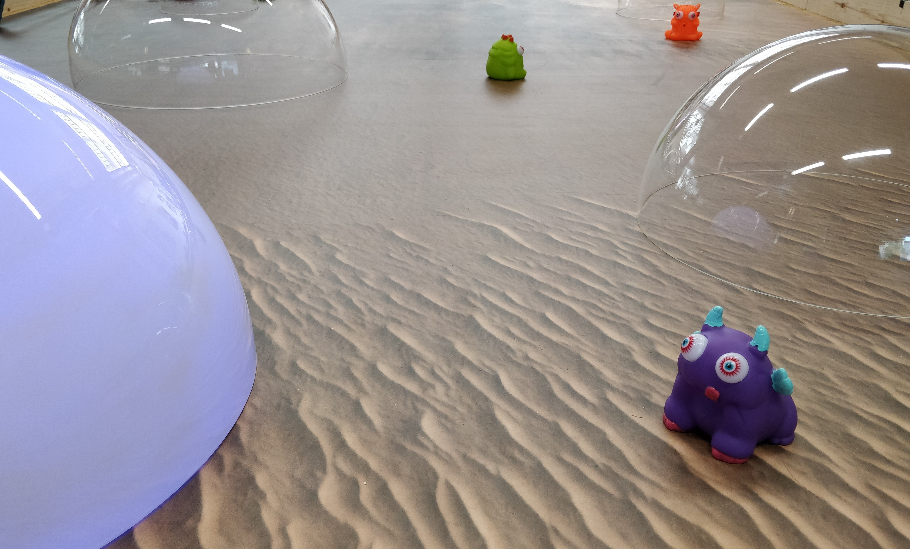
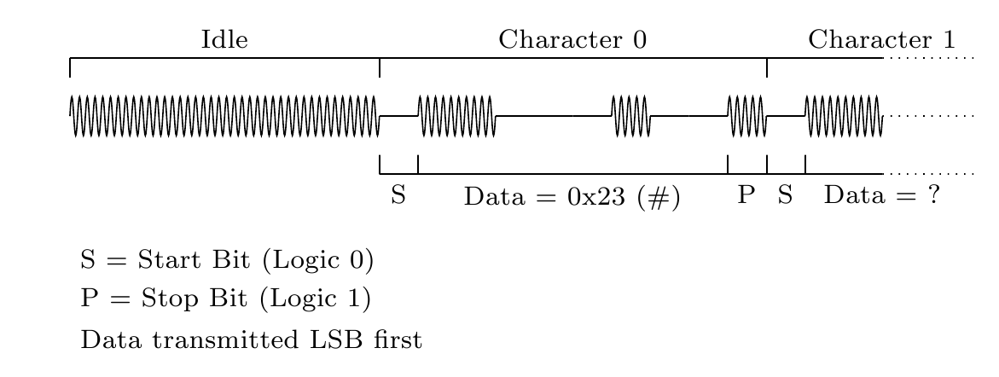

# ELEC40006 Electronics Design Project 
## Project Brief: EEERover
	
## Introduction
	
The Engineering Group Design Project is one of the six modules that make up your first year of study.
It brings together theoretical and practical content from your lectures and labs with important industrial skills relating to product design, project management and team working.
		
You will work in tutorial groups of 5–7 people to complete the project.
It will be assessed with an interim interview, a final report, and a demo.
		
## Brief

You are requested to design a remotely-controlled rover that can explore a remote planet and survey the alien creatures that live there.
Using a variety of electromagnetic signals, you must find out the name, age and magnetic polarity of each alien.

  
A prototype of the design must be built and tested in an artificial environment in the lab.
The quality of the design will be assessed against the following criteria:
- Is it possible to find the characteristics of all the aliens?
- Is the design cost and weight effective?
- Is the rover manoeuvrable enough to negotiate the environment?
- Is the construction robust and reliable?
- Is the remote control interface logical and easy to use?
	
## Characteristics of the aliens
### Name

The aliens communicate by radio and each alien will tell you its name.
Communication uses a carrier frequency of 89kHz, modulated with two-level *amplitude-shift keying* (on off modulation).
The name is encoded using ASCII character codes in UART packets with 1 start bit and 1 stop bit.
The data rate is 600 bits per second and each alien's name is four characters long, including an initial `#` symbol.
	

	
### Age

Aliens have a pulse that can be detected optically, just like humans.
As with humans, the pulse tends to slow with age, though the correlation is much stronger — the period of the pulse increases at exactly 1ms per century of lifetime.
Unlike humans, aliens emit infrared radiation at a wavelength of 950nm, allowing the pulse to be detected by passive observation with a suitable sensor.
	
Aliens spend the first century of their lives underground, so you won't encounter any aliens younger than that.
	
### Magnetic field

Most aliens have a static magnetic field orientated with their body.
In some aliens the field points away from the top of their head, in others it points towards.
Some aliens have no magnetic field at all.
	
## Deliverables and assessments
	
The project will be assessed with an interim interview, a final report and a demo with head-to-head competition.

### Reflection

**Date of assessment:  Weekly**

Complete a an online form each week to reflect on your professional practice

Marks weighting: 5%

### Interim Presentation

**Date of assessment:  1 June 2023**

The interim presentation is an opportunity to show your progress mid-way through the project.
You should prepare a presentation showing your high-level design, research and technical progress so far.
You should also present a plan for the remaining work to complete the project.

Marks weighting: 20%
	
### Report

**Date of submission:  15 June 2023**

The report is a formal documentation of all the technical and non-technical work you have done on the project.
The report should justify all your design decisions and include test results of various aspects of your prototype.
One team member should act as overall editor to ensure that the report is consistent in style and content.

Marks weighting: 35%
			
### Demo

**Date of assessment:  20 June 2023**

The demo is your opportunity to present your completed project.
There are two parts to the demo:
1. An assessment of your rover on the lab bench, where your examiner will ask to see different functional aspects and assess your theoretical understanding of the implementation
2. A test of your rover on the demonstration arena, where multiple groups will compete to survey all the aliens in the quickest time.

Marks weighting: 40%
	
## Getting started
				
### EEEBug Expansion Kit
Your EEEBug has been designed to support modification for work on this project.
The Orangepip will be replaced with an ARM-based microcontroller platform with a WiFi module, but you can continue to develop code using the Arduino framework and IDE.
The central PCB has connections for a motor driver module, which will simplify the challenge of steering and reversing your rover.
			
### Sensing
You should use the outcome of your lab experiments to develop ideas for making sensors and analogue interfaces to detect the signals.
The EEEBug experiment showed you an example of an optical sensor.
The Passive Networks experiment (Autumn Term) introduces the concept of resonant circuits which, if the inductor is suitably constructed and orientated, will oscillate in the presence of radio waves of the correct frequency.
Magnetic sensors are not covered directly in the labs and you should carry out your own research in this area.
			
In certain cases you may wish to detect particular frequencies while blocking others, and you have explored to do this with passive and opamp-based circuits.
Some sensors will produce a weak signal that will need amplification.

Signals will need to be converted into the digital domain for transmission back to the rover operator.
Consider whether a binary input is sufficient, or you need to measure the voltage with more precision.
Research software libraries that can help you determine time-domain characteristics such as frequency or serial data encoding.
			
### Construction
Mechanical design is not a core component of the EEE/EIE degree so it is left to you to be innovative in the construction of your rover.
The EEEBug chassis is designed to be a useful platform but feel free to modify it, taking into account the budget and weight constraints.
			
You can download a computer-aided manufacturing (CAM) drawing of the chassis, which can be modified for reproduction in acrylic with a laser cutter.
Workshop facilities are available on arrangement with the lab technicians.
You may wish to consider 3D printing, though you will need to research and teach yourself the necessary techniques first.
3D printers are available to use with the help of the lab technicians.	

### Demo Environment
The demo environment has a smooth floor with some uncrossable obstacles.
Aliens will be distributed across the environment, spaced at least 500mm apart.
Some aliens are very sensitive and they won't communicate if a heavy rover is nearby.
The arena is fitted with sensors in one area to check the weight of your rover.
